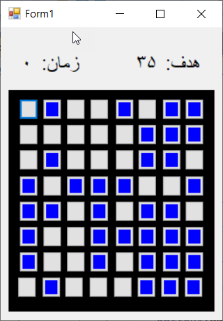

# C# Color Button Game

A simple color-based game developed with **C# Windows Forms**.

## About

In this game, colored buttons are randomly generated. The player must identify and click the correct colored buttons to complete the game.

## Features

* Random button color generation
* Mouse click event handling
* Timer-based gameplay
* Score/progress tracking
* Win and lose states
* Visual feedback using button colors
* Message-based game feedback

## Technologies

* C#
* Windows Forms
* .NET
* Visual Studio

## How to Run

1. Clone or download the repository.
2. Open the `.sln` file in Visual Studio.
3. Build the project.
4. Run the application.

## Project Purpose

This project was developed as a university programming exercise to practice **randomization, mouse events, timers, conditional statements, and Windows Forms application development**.

## Screenshots

